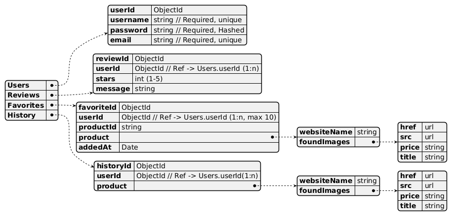

# Cél

Egy weg ár-összehasonlító szolgáltatás, amely:

- webshopok termékeit és áraikat gyűjti
- gyors keresést és szűrést kínál
- Saját ellátogatott termékeket könnyedén eltudja érni 
- Magyar és Angol nyelven beszélőek egyaránt tudják használni a weboldalt
- lehet véleményt írni az adott weboldalról
- lehet értékelni az adott weboldalról
- elmenteni az adott terméket

# Fő komponensek

1. Web frontend (ejs sablonmotor/CSS) - keresés, szűrés, akciófigyelő, előzmények kezelése, account
2. API Gateway + Backend(Node.js + Express) - üzleti logika, authorization
3. Scrapers - webes scraping, termékek keresése(párhuzamos keresés, memóriában való tárolás)
4. Adatbázis - nem relációs adatbázis(mongoDb), felhasználóak, előzmények, kedvencek tárolása

# Architektúra

[ FELHASZNÁLÓ (böngésző)] -> [ FRONTEND ] -> EJS sablon (+CSS) -> [ BACKEND ] -> Express.js router, webscraping -> [ ADATBÁZIS ] -> MongoDB(Json struktúra) felhasználóak, előzmények, kedvencek tárolása

# Adatmodell

## Users tábla

- userId -> ObjectId
- username -> string || Required, unique
- password -> string || Required, hashed
- email -> string || Required, unique

## Reviews tábla

- reviewId -> ObjectId
- userId -> ObjectId || Refer to Users.userId (1:n relation)
- stars -> int(1-5)
- message -> string
- vendor -> string

## Favorites tábla

- favoriteId -> ObjectId
- userId -> ObjectId || Refer to Users.userId(1:n)
- href -> string
- src -> string
- price -> string
- vencdor -> string

## History tábla

- historyId -> ObjectId
- userId -> ObjectId || Refer to Users.userId(1:n)
- href -> string
- src -> string
- price -> string

## GLOABLS tábla

- globalId -> ObjectId
- name -> string, required
- value -> string, required

# Fő oldalak és működés (+API endpoint)

endpointokról bővebben [itt](../README.md#api-endpointok)

# Tesztelés
- Unit + integrációs tesztek
- Bővebben [itt](./Tesztek.md)

# Sprintek 
1. Alapok - repo, dokumentumok, alap keresőrendszer, routing + minimális frontend
2. Optimalizálás, takarítás - kód tisztitás, dokumentumok javítása/pótlása, keresőrendszer optimalizálása, kerekebb API rendszer
3. Felhasználó/előzmények - adatbázis, bejelentkezés/regisztrációs felület + előzmények nézet
4. Kereső rendszer befejezése, Kedvencek + vélemény felület
5. Termék részletek, hibakezelés
6. Nyelvek