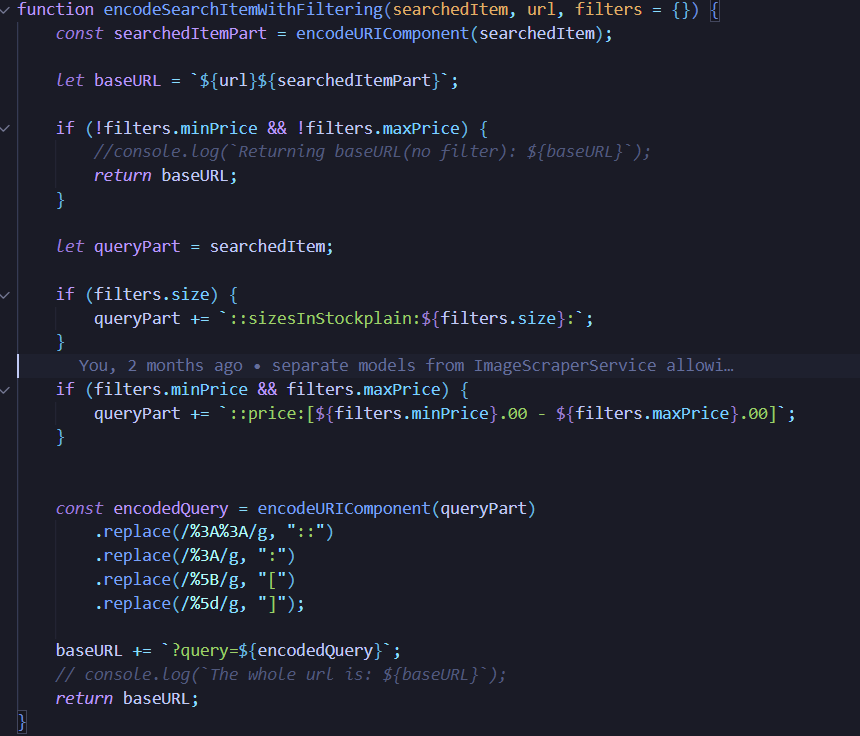
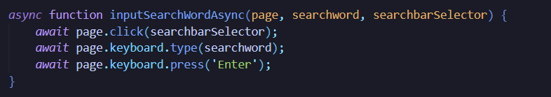
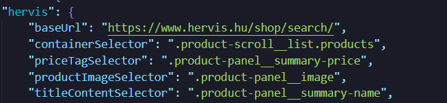
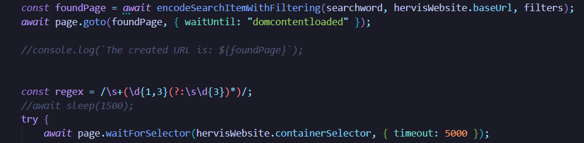
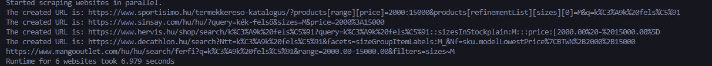
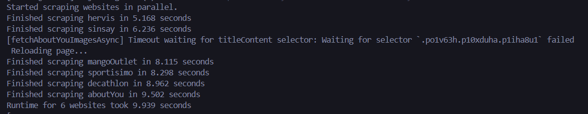

# Tartalomjegyzék

- [Leírás](#leírás)
- [Könyvtárak](#könyvtárak)
- [Hogyan Működik?](#hogyan-működik)
- [Bot Detektálás](#bot-detektálás)
- [Optimalizálás](#Optimalizálás)

# Leírás
A **Budget-árukereső** keresőmotorja automatikus **web scrapingre** alapszik. Ezzel a módszerrel biztosítjuk a **rugalmas keresést** a fix adatbázis-beillesztések helyett, így minden felhasználó tetszése szerint böngészhet a termékek között.

## Mi is a Web Scraping?
Más néven **webes adatgyűjtés**. Ez az az **automatikus folyamat**, amely különféle weboldalak nyers HTML-tartalmát dolgozza fel, és abból releváns adatokat (mi esetünkben ruhákat) nyer ki.

### FONTOS: Etikai és Jogi Megfontolások
A web scraping **vitatott téma** etikai és jogi szempontból. Minden weboldalon általában elérhető a `'robots.txt'` statikus elem, ahol a webhely üzemeltetői nyilatkoznak arról, **mit szabad a botoknak tenni** a weboldalon, és mit nem (az ún. **Disallow** utasítások). Ezt a dokumentumot figyelembe kell venni! Az AI korában ez a dokumentum átalakulóban van, AI-fókuszú szabályokkal, hogy kontrollálni lehessen az adathozzáférést.

# Könyvtárak
- Mi is kell egy keresőbot megírásához?

* **Programnyelv:** [Node.js](https://nodejs.org/en)
* **[Puppeteer](https://www.npmjs.com/package/puppeteer)**
    * Egy **böngészőautomatizáló eszköz**, ami lehetővé teszi, hogy programból vezéreljük a Chrome-ot vagy a Chromiumot. Ezzel könnyedén letölthetjük és feldolgozhatjuk a weboldalak tartalmát, mintha **valódi felhasználó** böngészne.
* **[p-limit](https://www.npmjs.com/package/p-limit)**
    * **Korlátozza** a párhuzamosan futó aszinkron műveletek számát, biztosítva, hogy a web scraping ne terhelje túl a gépet vagy a céloldalakat.
* **[puppeteer-extra-plugin-stealth](https://www.npmjs.com/package/puppeteer-extra-plugin-stealth)**
    * Némely weboldal erősen figyeli, hogy a felhasználók **valós user-agenttel** és **headerekkel** rendelkeznek-e. Detektálás esetén új elemeket mutathat, funkciókat blokkolhat, a DOM elemek változhatnak stb. Bővebben a [Bot Detektálás](#bot-detektálás) pontban.

## Opcionális Könyvtárak
* **[cheerio](https://www.npmjs.com/package/cheerio)**
    * Egy könnyű, gyors **HTML-átalakító könyvtár**. A weboldalak tartalmát **jQuery-szerű módon** lehet feldolgozni, amit a termék részleteinek kinyeréséhez használtunk bizonyos oldalaknál.
* **[dotenv](https://www.npmjs.com/package/dotenv)**
    * Lehetőséget biztosít a **környezeti változók** egyszerű kezelésére. Segítségével API kulcsokat és konfigurációs beállításokat biztonságosan tudunk tárolni.

# Hogyan Működik?
A fenti pontokban említettem pár fontos eszközt és módszert, amit ebben a részben fogok részletesen kifejteni.

## Headless Mód
Először is, nagyon fontos tudni, hogy a **Puppeteer** könyvtár **headless** böngészőt használ.
**Miben különbözik?** Röviden, egy böngésző **grafikus felhasználói felület (GUI) nélkül**. Mindent tartalmaz, amit egy sima böngésző, de a legfontosabb funkciója, hogy tud **futni a háttérben**.

Ezért:
* Gyorsabb teljesítmény
* Kevesebb erőforrást használ
* Imitálható felhasználói cselekvések
* Logikai renderelés
* Programozható bemenet (input)

## HTTP Kérés vs. Headless Browser
Jogosan kérdezheti az olvasó, hogy ezeket az információkat simán le lehetne-e kérni **HTTP kérésekkel**. Egyszerűbb, tisztább megoldás lenne, de sajnos ezzel a weboldalak is tisztában vannak.

Azonban, számos hátránnyal rendelkezik és **védelmi intézkedések** léteznek:
* Az adatokat titkosítva küldi a szerver a kliensnek.
* Nincs felismerhető rendszer a küldött adatokban (Nem lehet a GET kérést automatizálni).
* **Tokenekkel** írják alá az adatokat (hiányuk megtagadhatja a hozzáférést).
* A nyers HTML-t **JavaScript szükséglete mögé** rejtik.
* Némely adatot **JavaScripttel töltenek be** -> a nyers HTML-ből hiányozni fognak.

Jól látható, hogy több a hátránya, és minden weboldal **másokképp védekezik** a botokkal szemben!

## Feltérképezés
Mielőtt belefognánk az adatgyűjtő bot írásába, fontos **feltérképezni** a weboldalak erősségeit és gyengeségeit.
Még mindig muszáj kiemelnem, hogy minden weboldal **másokképp van felépítve**, és rengeteg buktatóval rendelkezik.
A feltérképezés az a folyamat, ahol megfigyeljük a weboldal működését, eldöntve a leghatékonyabb és megbízhatóbb gyűjtési stratégiát.

**Fontos megtekinteni:**
* HTML struktúrát
* Hogyan töltődnek be az adatok (**Statikusan** vagy **dinamikusan**)
* Milyen kéréseket küld a weboldal
* Hogyan működik a **pagination** (lapszámozás)
* Milyen **védelmi funkciók** léteznek
* Van-e **CAPTCHA**
* A **sütik** (cookie-k) működését

A sikeres feltérképezés biztosítja a kristálytiszta választ: elég-e egy GET kérés, vagy kelleni fog a Puppeteer, hogy a JavaScriptet is betöltse.

## Hogyan Térképeztük Fel a Weboldalakat?
Eredeti tervekben nagyobb ruha webáruházakat szerettünk volna összegyűjteni népszerűségük és kínálatuk miatt.
Azonban, minél nagyobb a cég, annál nagyobb a valószínűség, hogy **erősebben szűrik a botokat**.
**Tervezett áruházak:** Hervis, About You, Decathlon, H&M, Mango Outlet, Shein, Sinsay, Sportisimo.
**H&M és Shein kivételével** minden sikerült.

A fő cél a keresési funkció megismerése volt. Ez az *About You* kivételével majdnem mindenhol megegyezik: feltűnt, hogy a keresésnél a szűrés és a ruhadarabok **beleíródnak az URI-be**, ezért létre lehetett hozni **manuálisan** is ezeket az URI-ket.

> **Minta**
> 
>
> Az alábbi függvényben látható, hogyan működik a **Hervis** URI kódolása. Érdemes megfigyelni, hogy minden query-t **titkosítunk** (kódolunk), hogy a weboldal URI-nek megfeleljen.
>
> > *Némely esetekben vissza kell vonni a titkosítást, mert a weboldalak máshogy kezelik a speciális karaktereket.*

Az **About You** abban különbözik a többitől, hogy nem lehet létrehozni a keresett termékek URI-jét.
**Okok:**
* Minden keresés egy adott **dinamikus ID-t kap**, amire nem lehet mintát felvázolni.
* Emellett az URI tartalmazza a **nemeket**.
**Megoldás:** Imitáljuk a keresés beírását.

### Különös Megfigyelések
* **Shein** weboldal valós user-agentnél is ellenőrzi a CAPTCHA-t.
* **H&M** létrehozott URI esetén elrejti a termékeket, kikényszerítésnél pedig duplikálja azokat.
* Generált URI-nél nem kell sütit kezelni, mivel a Puppeteer el tudja érni a HTML elemeket.
* **Mango Outletnél** szintén fennáll a nemek tartalmazása az URI-ben, viszont egy véletlen generátorral létre tudtuk hozni az URI-t.
* Imitált cselekvésnél el kell fogadni a sütiket, mivel letilt a weboldal.
* **Hervis** rendelkezik **Shadow Tree DOM node** elemmel.
* *GET* kérésre az **About You** **üres HTML-t** dob vissza.
* *GET* kérésre a **Hervis NEM mindig** dob vissza eredményt.

## Hogyan nyerjük ki az adatokat
Az adatok kinyerésének folyamata a weboldal feltérképezése során szerzett ismeretekre épül.
Mivel projektünkben a hagyományos HTTP kérések(*GET*) gyakran sikertelenek voltak, a
**Puppeteer** alapú **headless böngésző** használata volt a fő adatgyűjtési módszer.

* A navigációról és keresési parametérezésről [itt](#hogyan-térképeztük-fel-a-weboldalakat)

* A betöltött adatok strukturálása

Miután a Puppeteer sikeresen betöltötte és renderelte a termékeket tartalmazó oldalt(beleértve az összes javascript által injektált adatot), 
megkezdődhet az adatok kinyerése.

### DOM elemzés
* A bot előre meghatározott **CSS szelektorok** vagy **XPath** kifejezések segítségével megkeresi azokat a konténereket(általában div vagy li elemek)
amelyek egy-egy terméket képviselnek.
* Ezt követően minden termékkonténerből kinyerjűk a szükséges adatpontokat
    - Terméknév
    - Ár -> Ezt tisztítani kell az eredeti szövegtől egy **Reguláris kifejezéssel**-el
    - Kép URL-je -> figyelembe kell venni a **Lazy Loading-ot**
    - Termék URL-je

> **Minta**
> 
> 
> Általában, *osztály* vagy *id* szelektorokat választunk ki

### Különleges esetek
-   Némely weboldal(pl.: Hervis ) alkalmazza a **Shadow Tree DOM** elemeket, amit a normál          szelektorok nem látják. Ezt különleges Puppeteer metódusokkal kell elérni.

> **Minta**
> 
>
> A mi esetünkben, szerencsére nem szigorú a fa ezért elég csak bizonyos kiválasztoknak a megjelenését megvárni.
> Nem szigorú fa azt jelenti, hogy **nyitott módban** 
lett létrehozva, ami lehetővé teszi  a JS-nek a hozzáférést
> Emellé, biztosítva van egy fix időtartam amíg nem jelenik meg a az adott szelektor, akkor újra betölti a weboldalt.

- **Lusta betöltés**(Lazy loading) egy optimalizációs technika, amely során csak akkor tölti be az erőforrásokat(például termékképeket), amikor azok a felhasználati nézet területére(viewport) kerülnek.

Ha csak betöltenénk, a nyers HTML-t akkor a képek **src** attribútuma üres lehet, vagy **alternatív tartalmat** tartalmazhat, mivel a Javascript még nem aktiválodott.

- Megoldás
    - A botnak **imitálni** kell valamilyen felhasználó cselekvést: görgetés, kattintás stb..
    - **Mango outlet** esetében URI navigálás után bele kell kattintani a szűrési mezőbe mivel vagy **nem alkalmazza** a szűrést vagy **nem töltenek be a képek.**

# Bot detektálás

A **bot detektálás** az a technikai eljárás, amelyet a weboldalak alkalmaznak annak érdekében, hogy **felismerjék** és **blokkolják** az automatizált szoftvereket (botokat) a valódi felhasználóktól.
**Célja** az adatok védelme, a szerver túlterhelésének megelőzése és a szolgáltatási feltételek betartatása.

## Passzív Detektálási Módszerek
Ezek a módszerek az HTTP kérések metaadatait vizsgálják.

* **User-Agent Ellenőrzés:** A szerver megnézi a kérésben lévő User-Agent fejlécet. A fejlécek, amelyek hiányoznak, vagy tipikus bot stringet tartalmaznak (pl. curl), azonnal blokkolhatók.

* **Fejlécek Hiánya (Headers):** Egy valós böngésző számos egyedi HTTP fejlécet küld (pl. Accept-Language). Ha ezek közül több hiányzik, vagy nem a szokásos sorrendben érkeznek, az botra utal.

* **IP-alapú Korlátozás:** Túl sok kérés rövid idő alatt ugyanarról az IP-címről (Rate Limiting) azonnali blokkolást vagy CAPTCHA-t eredményez.

## Aktív Detektálási Módszerek
Ezek a módszerek a JavaScript futtatási környezetet és a viselkedést vizsgálják.

* **Headless Mód Detektálása:** Az anti-bot rendszerek aktívan keresik a Puppeteer (Chromium) jellegzetes nyomait a böngészőben.

* **Eseménykövetés (Events):** A botok nem generálnak tipikus felhasználói eseményeket (egér mozgás, görgetés). A túl mechanikus, azonnali, vagy hiányzó cselekvések gyanúsak.

## Megoldások

A legkifinomultabb botdetektorok az **időzítést** figyelik. A **botok másodpercek** alatt végeznek el olyan műveleteket, amelyek egy embernek másodpercekig tartanak. A detektálás kikerülésére *kritikus* fontosságú volt a cselekvések **emberibbé** tétele:

* **Várakozási Idő Cselekvések Között**: Minden Puppeteer cselekvés (pl. kattintás, gépelés) közé véletlenszerű, de realisztikus várakozási időket illesztettünk be. Ez utánozza azt a szünetet, amit egy ember tesz két feladat között.

* **Tágabb várakozási idő**: Annak ellenére, hogy megjelenik a böngészőben az elem vannak észlelő egységek, amik figyelik az elemek aktív jelenlétét. Probléma esetén, újra indítják a weboldalt vagy befejezik a cselekvést üres elemekkel visszatérve.

* **Valós ujjlenyomat**: A puppeteer-extra-plugin-stealth egy kritikus eszköz a bot detektálás elkerülésében. Lényegében arra szolgál, hogy a Puppeteer által vezérelt Chromium böngészőt valódi, ember által használt böngészőnek álcázza.
    - Biztosít:
        - Manipulálja a window.navigatort 
        - Eltávolítja a webdriver flaget
        - Kijavítja a funkciók string reprezentációját(pl.: [native code])
        - valós ujjlenyomatot

## Mi esetünkben

* Sinsay bot detektálás esetén egy Captcha-t dob, amit nem lehet kijátszani és ezért abba kell hagyni a cselekvést.
* H&M(nincs megvalósítva) bot detektálás esetén duplikálja az adatokat + elrejti az adatokat 
* About You Headless mód detektálásnál sütit dob fel vagy teljesen elrejti az adattagokat (bővebben alul...)

#### About You
Ahogy a fenti pontokban említettem, az About You weboldala aktívan keresi az ujjlenyomatokat. Mivel, a sima Puppeteer biztosít egy jó user-agentet, de erősebb védelmi rendszereken nem hatol át.
**Megoldás:**
* A stealth plugin generál egy user-agentet kifejezetten mobilra, amit már nem tud detektálni a rendszer
* Ezt az user-agentet módosítani kell nézetben mivel más elemeket jelenít meg
> Teljes mobil nézetben hagyva parralell gyűjtésnél eltöri a többi weboldal müködését

**Hátrányok:**
Bár a puppeteer-extra-plugin-stealth kulcsfontosságú a bot detektálás elkerülésében, a használata jár bizonyos kompromisszumokkal és hátrányokkal.

* Teljesítménycsökkenés
* Törékenység
* Karbantartás hiánya
* Nem elég a zárt rendszerek ellen

# Optimalizálása
A keresési (scraping) folyamat optimalizálásának elsődleges célja, hogy minimalizáljuk a teljes futási időt, miközben fenntartjuk az emberi viselkedés imitációjának szintjét és elkerüljük a blokkolást.

## **Párhuzamos Web Scraping**
Mivel a web scraping alapvetően I/O-intenzív (Input/Output) művelet (sok hálózati kérésről van szó), a **leglassabb pont** nem a kód futása, hanem a **várakozás a hálózati** válaszra. A **párhuzamosítás** erre ad megoldást.
* **A Probléma** 
A Puppeteer indítása és egy oldal teljes renderelése erőforrás-igényes és időigényes folyamat. Ha egymás után futtatjuk az áruházak scrapingjét, a teljes futási idő összeadódik. Nagyobb, valós futási időknél ez **órákat jelenthet** a párhuzamosítás drasztikusan csökkenti ezt (pl. 6 áruház 60 másodperc helyett 8 másodperc alatt fut le 4 egyidejű szállal).
A Megoldás: A párhuzamosítás során a bot egyszerre több böngésző példányt (vagy fület) indít el, és egyidejűleg küldi a kéréseket különböző áruházaknak vagy a pagination következő oldalaira.
* **Korlátozás (p-limit)**
Mivel a Node.js géped erőforrásai és a céloldalak anti-bot rendszerei korlátozottak, nem indíthatunk végtelen számú párhuzamos műveletet. A *p-limit könyvtár* itt kulcsfontosságú
* **Maximális Párhuzamosság** 
Meghatározunk egy biztonságos maximumot (pl. 3-6 egyidejű Puppeteer példány), amit a gépünk még elvisel.
* **Eredmény**
A párhuzamos futtatással az 60 másodperces futási idő a limitált párhuzamossági szintnek megfelelően (pl. 6) jelentősen csökken.

##  **Dinamikus Várakozási Idők**
A statikus, fix várakozási idő (pl. `await sleep(3000)`) **egyszerre veszélyes** és **nem hatékony**: ha túl rövid, detektálnak; ha túl hosszú, lassú a bot. A dinamikus várakozás feloldja ezt az ellentmondást.
* **Célzott Várakozás (Legfontosabb)**
A legfontosabb optimalizálás az, hogy ne fix időre várjunk, hanem egy adott eseményre vagy egy elem megjelenésére.
`page.waitForSelector(selector)`: Ezzel a módszerrel a bot addig vár, amíg a termékeket tartalmazó fő DOM elem (pl. `'.product-grid'`) meg nem jelenik. Ez garantálja, hogy a JS lefutott és a tartalom betöltődött.
`page.waitForNavigation()` / `page.waitForLoadState()`: Navigáció után nem fix időt várunk, hanem megvárjuk, amíg a böngésző jelzi, hogy az oldal (vagy annak fontos részei) betöltődtek.

Ezekkel a módszerekkel jelentősen lecsökken a keresési ideje.
Az alábbi képek reprezentálják a változásokat

1. Zéró optimalizálással

> 3 weboldal-t keresett csak

2. Statikus várakozási elemek eltávolításával

3. Parallel scraping

4. 6 weboldallal

4. Anti bot detektálással + fallback
